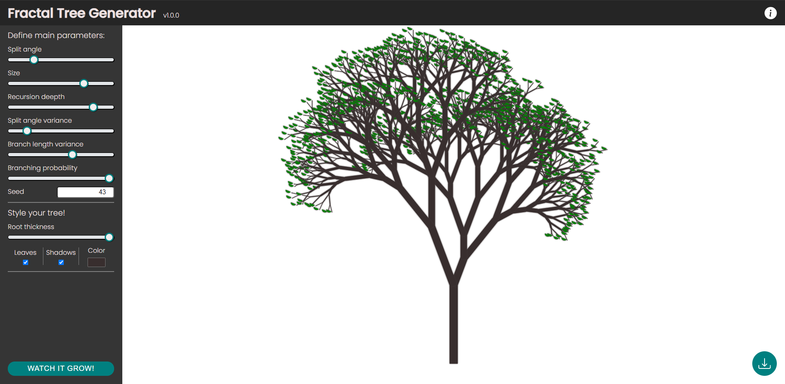

# Fractal Tree Generator

Prosta aplikacja rysująca za pomocą html canvas drzewiasty fraktal. 

[DEMO](https://fadikk367.github.io/Fractal-Tree-Generator/)

Interfejs pozwala na edycję rozmaitych parametrów głównie za pomocą formularzy znajdujących się w menu bocznym. Parametry odpowiadają za strukturę drzewa oraz jego styl. Klikając w przycisk "WATCH IT GROW" w lewym dolnym roku można zobaczyć animację rysowania drzewa od korzenia w górę. Za animację odpowiada Web Worker, który poprzez transfer otrzymuje element OffscreenCanvas oraz poprzez kopiowanie strukturę drzewa rozbitą na punkty wraz z niezbędnymi informacjami dotyczącymi styli. Stworzone drzewo można pobrać w formacie JPEG klikając przycisk w prawym dolnym rogu ekranu.

## Wykorzystane technologie
* HTML5, 
* CSS3 (min. flexbox i transition)
* JavaScript (ES6), 
* Web Wrokers, 
* OffscreenCanvas 

## Obsługa przeglądarek
Projekt został przygotowany na przeglądarkę *Google Chrome v84+*

## Źródła
* [Dokumentacja MDN](https://developer.mozilla.org/pl/)
* [CSS-Tricks](https://css-tricks.com/)
* [Wikipedia - Fraktale](https://en.wikipedia.org/wiki/Fractal)

Zdjęcia
*  [1] - [Zbiór Mandelbrota](https://de.wikipedia.org/wiki/Datei:Blue-Gold_Mandelbrot_Set.jpg)
*  [2] - [Przykładowy fraktal](https://pl.pinterest.com/pin/126241595775589176/)
*  [3] - [Kalafior rzymski](https://en.wikipedia.org/wiki/Romanesco_broccoli#/media/File:Fractal_Broccoli.jpg)
*  [4] - [Aloes](https://pl.pinterest.com/pin/116460340334269511/)
*  [5] - [Płatek śniegu](http://www.snowcrystals.com/branching/branching.html)
